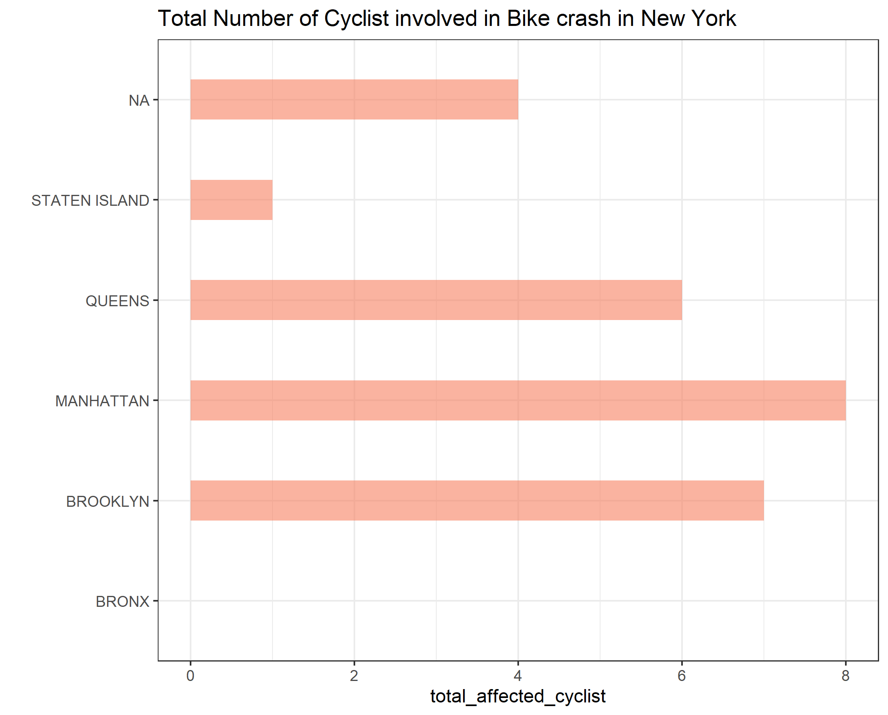

# Results and Insights

1) To answer the question "the most dangerous borough as owner of a bicycle", we need to take into consideration both the number of people killed and injured during a bike crash in all the boroughs.

The chart below shows that Manhattan has the highest number of cyclist killed and injured in a bike crash. No surprise as Manhattan is densely populated and more prone to bike crash relate to other boroughs

2) To answer the qustion about the worst place to have a citibyke station, we need to know the number of available bikes in each location, Locations with low number of bikes are not suitable for location of Bike station from business perspective. The map visualization below shows the areas with high number of bikes availble, areas with darker color show high number of bike availablity. the areas with ligh yellow color are areas with low number of bikes which is not suitable for locating bike station from economic perspectives, with this we can conclude the areas the very light yellow are the worst place to locate bike station.

