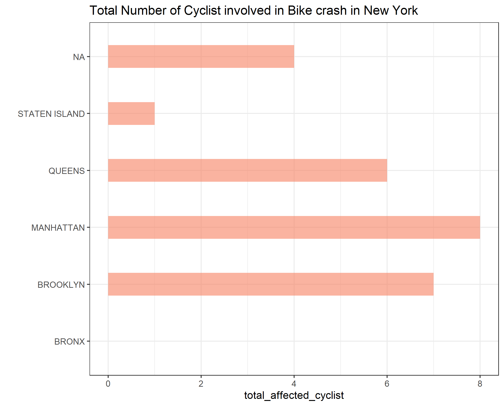

# Results and Insights

1) To answer the question "the most dangerous borough as owner of a bicycle", we need to take into consideration both the number of people killed and injured during a bike crash in all the boroughs.

The chart below shows that Manhattan has the highest number of cyclist killed and injured in a bike crash. No surprise as Manhattan is densely populated and more prone to bike crash relate to other boroughs

<p align="center">

</p>


2) To answer the qustion about the worst place to have a citibyke station, we need to know the number of available bikes in each location, Locations with low number of bikes are not suitable for location of Bike station from business perspective. The map visualization below shows the areas with high number of bikes availble, areas with darker color show high number of bike availablity. the areas with ligh yellow color are areas with low number of bikes which is not suitable for locating bike station from economic perspectives, with this we can conclude the areas the very light yellow are the worst place to locate bike station.

<p align="center">

</p>

You can check a more interactive map visualization [here](https://github.com/Godskid89/Code-Challenge/blob/visualize/bikes_available.html)


3) This data is not suitable for machine learning and predictive modeling. some important columns which include "contibuting factors 1 to 5 and vehicle type code 1 to 5" have missing values as high as 99%. The high rate of missing values makes this data useless with regards to machine learning modeling.

Although there are several methods missing values can be handled which include
- Casewise deletion
- Mean/Median imputation
- Encoding missing values as another level of categorical variables
- Predicting values of missing value using predictive models

All the method listed above will still lead to model inaccuracy and bias if implemented due to the high missing value

Below is the output of the percentage of missing values in each column

```> map(crashes, ~mean(is.na(.)*100))
$crash_date
[1] 0

$crash_time
[1] 0

$latitude
[1] 8.5

$longitude
[1] 8.5

$location
[1] 4.25

$on_street_name
[1] 22.6

$number_of_persons_injured
[1] 0

$number_of_persons_killed
[1] 0

$number_of_pedestrians_injured
[1] 0

$number_of_pedestrians_killed
[1] 0

$number_of_cyclist_injured
[1] 0

$number_of_cyclist_killed
[1] 0

$number_of_motorist_injured
[1] 0

$number_of_motorist_killed
[1] 0

$contributing_factor_vehicle_1
[1] 0.3

$contributing_factor_vehicle_2
[1] 17.4

$collision_id
[1] 0

$vehicle_type_code1
[1] 0.4

$vehicle_type_code2
[1] 22

$borough
[1] 36.9

$zip_code
[1] 37

$cross_street_name
[1] 77.4

$off_street_name
[1] 50.6

$contributing_factor_vehicle_3
[1] 93.2

$vehicle_type_code_3
[1] 93.6

$contributing_factor_vehicle_4
[1] 98.6

$vehicle_type_code_4
[1] 98.7

$contributing_factor_vehicle_5
[1] 99.7

$vehicle_type_code_5
[1] 99.7```
